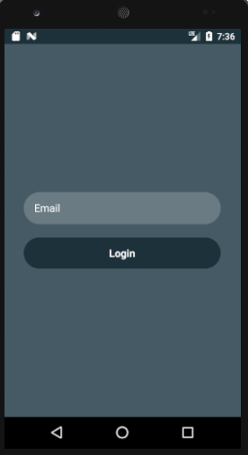
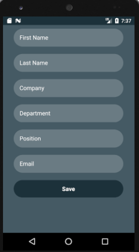

# Insert and Get data using React Native and firebase database

### Installation(after cloning repository run following command from path)

```
npm install

```

### For start project you need to start emulator first , then open Terminal and execute:

```
react-native run-android

```

Result –


