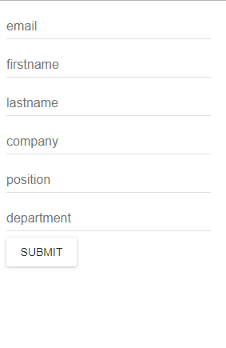

# Insert and Get data using React and firebase

### Installation(after cloning repository run following command from path)

```
npm install

```

### For start project open Terminal and execute:

```
npm run dev

```

Result –


